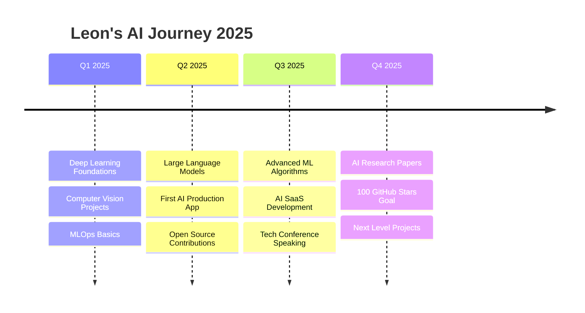

<div align="center">

<!-- Animiertes Banner -->
<div align="center">
  
</div>

### Python Developer • AI Enthusiast • 16 Years Old

[](https://en.wikipedia.org/wiki/Baden-W%C3%BCrttemberg)
[](#)
[](#)

```ascii
    ╔══════════════════════════════════════════════════════════════╗
    ║  "Building the future, one line of Python at a time"         ║
    ╚══════════════════════════════════════════════════════════════╛
```

</div>

---

## 🎯 About Me

<table>
<tr>
<td width="60%">

**Hey! I'm Leon** 👋

- 🧠 **16 years old** from Baden-Württemberg, Germany
- 🐍 **Python enthusiast** diving deep into AI & Machine Learning
- 🏆 **Award winner**: Landespreis Medienbildung for explaining AI & ChatGPT
- ⚡ **Growth mindset**: Always seeking challenges and collaborations
- 🚀 **Mission**: Using code to solve real-world problems

</td>
<td width="40%">

```python
class Leon:
    def __init__(self):
        self.age = 16
        self.location = "Baden-Württemberg, DE"
        self.languages = ["Python"]
        self.interests = ["AI", "ML", "Game Development"]
        self.goal = "Build amazing things"
    
    def current_focus(self):
        return "Learning Python & exploring AI"
```

</td>
</tr>
</table>

---

## 🛠️ Tech Stack & Tools

<div align="center">

### Languages & Frameworks


### Data Science & AI


### Development Tools


</div>

---

## 🎮 Featured Project

<div align="center">

<a href="https://github.com/LeonT111/Tetris">
  
</a>

### 🎯 Tetris Game Engine
**Tech Stack:** Python • Pygame  
**Features:** Full game mechanics, smooth animations, collision detection  
**Status:** ✅ Complete & Playable

[🔗 **View Project**](https://github.com/LeonT111/Tetris) • [📱 **Play Demo**](#)

</div>

---

## 📊 GitHub Analytics

<div align="center">


### 📈 Contribution Activity


</div>

---

## 🎯 2025 Roadmap

<div align="center">



</div>

### 🚀 Current Learning Path

<table>
<tr>
<td width="50%">

**🔬 Exploring Now**
- 🧠 Deep Learning Architectures
- 🤖 Large Language Models (LLMs) 
- 🔍 Computer Vision Applications
- 📈 Reinforcement Learning
- ⚡ MLOps & Model Deployment

</td>
<td width="50%">

**🎯 2025 Goals**
- 🏆 Deploy 3 Production AI Models
- 📚 Contribute to 10+ Open Source Projects
- 🎓 Complete Advanced ML Certification
- 💼 Build AI-Powered SaaS Application
- 🌟 Reach 1,000 GitHub Stars

</td>
</tr>
</table>

---

## 🌟 Achievements & Recognition

<div align="center">

| 🏆 Achievement | 📅 Year | 📝 Details |
|:---|:---:|:---|
| **Landespreis Medienbildung** | 2025 | Awarded for explaining AI & ChatGPT concepts |
| **First Game Release** | 2025 | Successfully built and released Tetris game |
| **Python Proficiency** | 2025 | Solid foundation in Python programming |
| **AI Knowledge** | 2025 | Deep understanding of AI/ML fundamentals |

</div>

---

## 💫 What Makes Me Unique

<div align="center">

<details>
<summary>✨ <strong>Click to discover more about me</strong></summary>

<br>

🧠 **AI Visionary** → Passionate about creating AI solutions that genuinely help people  
🎮 **Creative Coder** → Love building games that challenge both players and myself  
📚 **Knowledge Seeker** → Always reading the latest ML papers and experimenting  
🤖 **Future Builder** → Believe AI will revolutionize how we solve problems  
⚡ **Clean Code Advocate** → Beautiful, readable code is the foundation of great software  
🌍 **Community Contributor** → Excited to share knowledge and learn from others  
🎯 **Challenge Embracer** → Complex problems are just puzzles waiting to be solved  
🚀 **Innovation Driver** → Always pushing boundaries and trying new approaches  

</details>

</div>

---

## 📱 Let's Connect & Collaborate

<div align="center">

### 🤝 Ready for exciting projects and collaborations!

[](https://github.com/LeonT111)
[](mailto:your.Leon@Tscheschlock.de)
[](https://discord.gg/yourserver)

### 💬 Always open to:
**🔥 AI Projects** • **🎮 Game Development** • **📚 Knowledge Sharing** • **🚀 Startups Ideas**

</div>

---

<div align="center">

### 🎊 Thanks for visiting my profile!


---

**💡 "The best way to predict the future is to create it with AI and Python"**

*Made with ❤️ by Leon • Last updated: 2025*

</div>
