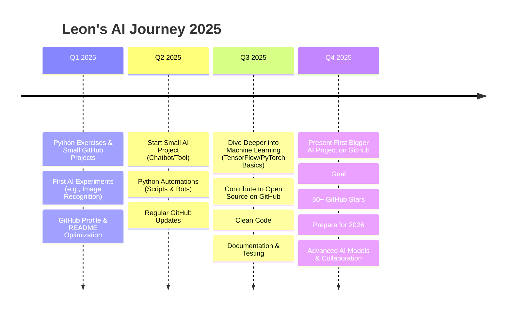

<div align="center">

<!-- Animiertes Banner -->
<div align="center">
  
</div>

### Python Developer • AI Enthusiast • 16 Years Old

[](https://en.wikipedia.org/wiki/Baden-W%C3%BCrttemberg)
[](#)
[](#)

```ascii
    ╔══════════════════════════════════════════════════════════════╗
    ║  "Building the future, one line of Python at a time"         ║
    ╚══════════════════════════════════════════════════════════════╛
```

</div>

---

## 🎯 About Me

<table>
<tr>
<td width="60%">

**Hey! I'm Leon** 👋

- 🧠 **16 years old** from Baden-Württemberg, Germany
- 🐍 **Python enthusiast** diving deep into AI & Machine Learning
- 🏆 **Award winner**: Landespreis Medienbildung for explaining AI & ChatGPT
- ⚡ **Growth mindset**: Always seeking challenges and collaborations
- 🚀 **Mission**: Using code to solve real-world problems

</td>
<td width="40%">

```python
class Leon:
    def __init__(self):
        self.age = 16
        self.location = "Baden-Württemberg, DE"
        self.languages = ["Python"]
        self.interests = ["AI", "ML", "Game Development"]
        self.goal = "Build amazing things"
    
    def current_focus(self):
        return "Learning Python & exploring AI"
```

</td>
</tr>
</table>

---

## 🛠️ Tech Stack & Tools

<div align="center">

### Languages & Frameworks


### Data Science & AI


### Development Tools


</div>

---

## 🎮 Featured Project

<div align="center">

<a href="https://github.com/LeonT111/Tetris">
  
</a>

### 🎯 Tetris Game Engine
**Tech Stack:** Python • Pygame  
**Features:** Full game mechanics, smooth animations, collision detection  
**Status:** ✅ Complete & Playable


</div>

---

## 📊 GitHub Analytics

<div align="center">


### 📈 Contribution Activity


</div>

---

## 🎯 2025 Roadmap

<div align="center">



</div>
<div align="center">

### 🚀 Current Learning Path

<table>
<tr>
<td width="50%">


**🔬 Exploring Now**
- 🐍 Learning Python deeply & building projects
- 🧠 Diving deeper into AI & Machine Learning

- 🔍 Small AI experiments (chatbots, image recognition, automations)
- ⚡ Writing clean code & improving programming logic

</td>
<td width="50%">

**🎯 2025 Goals**
- 🏆 Master Python to handle complex projects
- 📚 Make first contributions to open-source projects
- 🎓 Publish own AI tool or small project on GitHub
- 💼 Build small Python/KI projects
- 🌟 Goal: 50+ GitHub stars for own projects

</td>
</tr>
</table>

---

## 🌟 Achievements & Recognition

<div align="center">

| 🏆 Achievement | 📅 Year | 📝 Details |
|:---|:---:|:---|
| **Landespreis Medienbildung** | 2025 | Awarded for explaining AI & ChatGPT concepts |
| **First Python Project** | 2025 | Built and published first small Python project on GitHub |
| **AI Experiments** | 2025 | Completed first AI experiments (chatbots, image recognition) |
| **GitHub Milestone** | 2025 | Organized profile & published multiple projects |

</div>

---

## 💫 What Makes Me Unique

<div align="center">

<details>
<summary>✨ <strong>Click to discover more about me</strong></summary>

<br>

🧠 **AI Visionary** → Passionate about experimenting with AI projects and small tools  

🎮 **Creative Coder** → Enjoy building Python projects and games like Tetris  

📚 **Knowledge Seeker** → Always learning new Python libraries & ML concepts  

🤖 **Future Builder** → Exploring how AI can solve real-world problems  

⚡ **Clean Code Advocate** → Writing readable, organized Python code  

🌍 **Community Contributor** → Sharing projects on GitHub and learning from others  

🎯 **Challenge Embracer** → Enjoy tackling challenging coding problems  

🚀 **Innovation Driver** → Always trying new projects and coding approaches  

</details>

</div>

---

</div>

## 📱 Let's Connect & Collaborate

<div align="center">

### 🤝 Ready for exciting projects and collaborations!

[](https://github.com/LeonT111)
[](mailto:your.Leon@Tscheschlock.de)


### 💬 Always open to:
**🔥 AI Projects** • **🎮 Game Development** • **📚 Knowledge Sharing** • **🚀 Startups Ideas**

</div>

---

<div align="center">

### 🎊 Thanks for visiting my profile!


---

**💡 "The best way to predict the future is to create it with AI and Python"**

*Made with ❤️ by Leon • Last updated: 2025*

</div>
